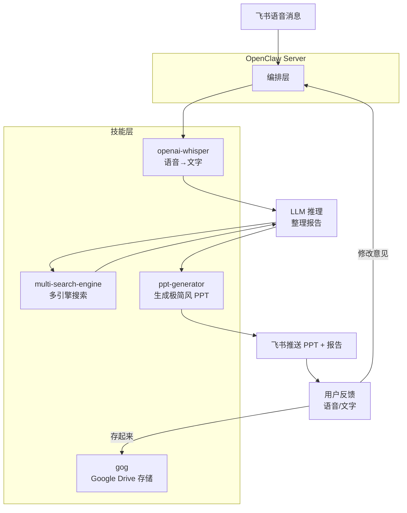

# 🧪 龙虾大学：语音调研实战（说句话，出报告）

> **适用场景**：开车时突然想调研一个选题，但腾不出手打字；散步时灵感迸发，想让 AI 帮你搜集资料整理成 PPT；团队头脑风暴后，想快速把讨论结论变成有数据支撑的调研文档。**你只需要对着手机说一句话，龙虾帮你搜、帮你做 PPT、帮你存。**

语音调研的核心理念是**用嘴巴代替键盘**：你只负责"说清楚想调研什么"，剩下的交给 AI。OpenClaw 负责接收飞书语音消息并转写文字（Whisper），调用多引擎搜索收集资料（multi-search-engine），用 LLM 整理成结构化报告并生成极简风 PPT（ppt-generator），推送到飞书供你预览。你对内容不满意就继续语音反馈，龙虾反复迭代直到你说"存起来"，最终一键归档到 Google Drive。

---

## 1. 你将得到什么（真实场景价值）

跑通后，你会拥有一个**随叫随到的调研助理**：

### 场景 1：开车时一句话启动调研
- **问题**：通勤路上听到一个行业动态，想深入了解，但没法打字
- **解决**：对着飞书发一条语音"帮我调研一下 AI Agent 在企业落地的最新进展"，龙虾自动转写、搜索、生成 PPT，到公司打开飞书或 Google Drive 就能看

### 场景 2：多轮反馈，越聊越深
- **问题**：第一版报告太泛，想补充竞品对比或数据支撑
- **解决**：语音回复"加上 Anthropic、OpenAI、Google 三家的具体产品对比"，龙虾再次搜索、补充内容、更新 PPT，直到你满意

### 场景 3：散步时的灵感捕捉
- **问题**：跑步/散步时突然想到一个选题，回到家就忘了
- **解决**：立刻语音发给龙虾"帮我调研低代码平台 2026 年市场规模和头部玩家"，回家后 PPT 已经在飞书和 Google Drive 里等你

### 场景 4：会后快速输出调研文档
- **问题**：开完会老板说"下午给我一份 XX 方向的调研"，从零开始来不及
- **解决**：会议结束后语音发送核心问题，龙虾 10 分钟内生成初版 PPT 和报告，你在此基础上修改润色

---

## 2. 技能选型：为什么这些是"最小可行集"？

### 核心架构

<!--  -->




### 安装技能

```bash
clawhub install skill-vetter          # 安全守卫（必须第一个安装）
clawhub install openai-whisper        # 核心：语音转文字
clawhub install multi-search-engine   # 核心：多引擎搜索
clawhub install ppt-generator         # 核心：生成极简风 PPT
clawhub install gog                   # 核心：Google Drive 存储
```

### 为什么是这 5 个？

| 技能 | 不可替代性 | 替代方案风险 |
|------|-----------|-------------|
| **skill-vetter** | 自动扫描技能是否窃取 API Key | 不安装可能被恶意技能盗号 |
| **openai-whisper** | 本地运行，离线可用，支持中英文混合识别，无 API 费用 | 在线 STT 服务有隐私风险且按量计费 |
| **multi-search-engine** | 17 个搜索引擎统一接口，中英文双覆盖，完全免费 | 单一搜索引擎覆盖面不足，调研质量下降 |
| **ppt-generator** | 一键生成乔布斯风极简科技感竖屏 HTML 演示稿，可直接在飞书预览 | 手动排版 PPT 耗时，且难以在手机上操作 |
| **gog** | Google Drive + Docs 完整集成，支持创建/上传/分享 | 手动复制粘贴到云盘，无法自动化 |

> **重要前提**：语音转写需要 OpenClaw 服务器上安装 Whisper CLI，因此必须将工具配置档设为 `coding` 或 `full`（默认的 `messaging` 不支持命令执行）。详见[第七章 工具与定时任务](/cn/adopt/chapter7/)。

> **无法访问 Google？** 本教程以 `gog`（Google Drive）为存储方案。如果你在中国大陆且没有网络代理，可以用 `feishu-doc` 技能替代 `gog`，将报告和 PPT 存到飞书文档；或直接保存为本地文件。后文所有涉及 Google Drive 的步骤均可按此替换，不再重复说明。

---

## 3. 配置指南：从安装到生效的完整流程

### 3.1 前置条件

| 条件 | 说明 | 参考 |
|------|------|------|
| 飞书渠道已配置 | OpenClaw 已接入飞书，能收发消息 | [第四章 聊天平台接入](/cn/adopt/chapter4/) |
| 工具配置档为 coding/full | OpenClaw Agent 需要命令执行权限 | [第七章 工具与定时任务](/cn/adopt/chapter7/) |
| 服务器已安装 Python >= 3.10 | Whisper 运行依赖 | — |
| Google OAuth 凭证已配置 | gog 技能需要 Google Drive 访问权限 | 下方 3.3 节 |

### 3.2 Whisper 安装与验证

**macOS（Homebrew）**：

```bash
brew install openai-whisper
```

**Linux / WSL2（pipx，推荐）**：

```bash
# 安装 ffmpeg（Whisper 依赖）
sudo apt update && sudo apt install -y ffmpeg

# 用 pipx 安装 Whisper（避免污染系统 Python）
sudo apt install -y pipx
pipx install openai-whisper
```

<details>
<summary>为什么不用 pip install？</summary>

Python 3.12+ 的 Linux 发行版（Ubuntu 24.04、Debian 12 等）默认启用了 [PEP 668](https://peps.python.org/pep-0668/) 保护，直接 `pip install` 会报 `externally-managed-environment` 错误。`pipx` 会自动创建隔离的虚拟环境，既安全又方便。

如果你更习惯手动管理虚拟环境：

```bash
python3 -m venv ~/.venvs/whisper
source ~/.venvs/whisper/bin/activate
pip install -U openai-whisper
```

</details>

<details>
<summary>Windows 安装方式</summary>

Windows 建议在 WSL2 中按上面的 Linux 步骤安装。或使用 Conda：

```bash
conda install -c conda-forge openai-whisper
```

</details>

验证安装成功：

```bash
whisper --help
```

> **首次运行会下载模型**（默认 `turbo`，约 1.5 GB），之后离线可用。如果网络慢，可以先手动下载到 `~/.cache/whisper/`。

### 3.3 Google Drive 配置（gog）

如果你已经在其他教程中配置过 gog，可以跳过这一步。

gog 技能需要三步：安装 gog CLI → 创建 Google OAuth 凭证 → 授权登录。

```bash
# 安装 gog CLI
brew install steipete/tap/gogcli

# 验证
gog --version
```

<details>
<summary>完整 Google OAuth 配置流程（首次配置必看）</summary>

**第一步：启用 Google API**

1. 访问 [Google Cloud Console](https://console.cloud.google.com/)，登录你的 Google 账号
2. 创建或选择一个项目
3. 在 **APIs & Services → Library** 中搜索并启用：Gmail API、Google Calendar API、Google Drive API、Google Sheets API、Google Docs API、Google Slides API


**第二步：配置 OAuth 同意屏幕**

1. 进入 **Google Auth platform → Branding**，填写 App name（如"gog-cli"）和邮箱
2. Audience 选择 **External**
3. 在 **Audience → Test users** 中添加你的 Gmail 地址

**第三步：创建凭证**

1. 进入 **Google Auth platform → Clients** → **Create Client**
2. Application type 选择 **Desktop app**，点击 Create
3. 下载 `client_secret_xxx.json` 文件，存放到安全位置（如 `~/.config/gog/`）

> **远程服务器**：如果 OpenClaw 运行在远程服务器上，需要先在服务器创建目录，再上传凭证：
> ```bash
> # 远程服务器：创建目录
> ssh user@your-server "mkdir -p ~/.config/gog"
> # 本地执行：上传凭证到远程服务器
> scp client_secret_xxx.json user@your-server:~/.config/gog/
> ```

**第四步：授权登录**

```bash
# 导入凭证（使用实际存放路径）
gog auth credentials ~/.config/gog/client_secret_xxx.json
```

> **远程服务器必读**：`gog auth add` 会在本机启动一个临时 HTTP 服务器接收 Google 的 OAuth 回调。但远程服务器的 `127.0.0.1` 不是你的浏览器所在机器，回调必然失败（`ERR_CONNECTION_REFUSED`）。需要通过 SSH 端口转发解决，**按以下顺序操作**：
>
> ```bash
> # ⓪ 远程服务器（只需执行一次）：headless Linux 没有桌面密钥环，必须切换为文件存储
> gog config set keyring_backend file
>
> # ① 远程服务器：执行授权命令（先不要关！注意替换为你的 Gmail 地址）
> gog auth add your-email@gmail.com --services gmail,calendar,drive,contacts,sheets,docs,slides
>
> # 输出一个很长的 URL，端口号藏在 redirect_uri 参数里：
> # ...redirect_uri=http%3A%2F%2F127.0.0.1%3A44261%2Foauth2%2Fcallback...
> #                                          ^^^^^
> #                                     这就是端口号（每次随机，本例为 44261）
>
> # ② 本地电脑：另开一个终端，用 ① 中的端口号建立 SSH 隧道（30 秒内完成！）
> ssh -L 44261:localhost:44261 user@your-server
>
> # ③ 本地浏览器：粘贴 ① 中的完整 URL，完成 Google 授权
> # 授权时登录的 Google 账号必须与 ① 中的邮箱一致，否则会报 email 不匹配
> # 回调会通过 SSH 隧道到达远程服务器，① 的进程自动完成授权
> ```
>
> **注意事项**：
> - `%3A` 是 `:` 的 URL 编码，`127.0.0.1%3A44261` 就是 `127.0.0.1:44261`
> - 每次执行端口都不同，必须用实际输出的端口建隧道
> - gog 的临时 HTTP 服务器有超时限制，从看到端口号到打开浏览器**不要超过 30 秒**，否则需要重新执行 ①
> - 如果遇到 `store token: Object does not exist at path "/"` 错误，说明未执行 ⓪（keyring 配置）
> - 授权成功后，gog 会提示 `Enter passphrase to unlock keyring`——这是文件密钥环的加密密码，**首次使用时设置，后续每次 `gog` 操作都需要输入**。请牢记此密码，丢失后需删除 `~/.config/gogcli/keyring` 重新授权
> - SSH 隧道终端偶尔出现 `channel N: open failed: connect failed: Connection refused` 是正常现象（浏览器残留重试），不影响授权结果

如果 OpenClaw 运行在**本机**，直接执行即可：

```bash
gog auth add your-email@gmail.com --services gmail,calendar,drive,contacts,sheets,docs,slides
```


验证：

```bash
gog auth list
```
设置默认账号：

```bash
export GOG_ACCOUNT=you@gmail.com
echo 'export GOG_ACCOUNT=you@gmail.com' >> ~/.bashrc
```

</details>

### 3.4 开启命令执行权限

```bash
openclaw config set tools.profile coding
```

### 3.5 编写工作区规则（IDENTITY.md）

把以下内容追加到 `~/.openclaw/workspace/IDENTITY.md`，让 OpenClaw 知道收到调研任务时如何协调各技能：

```markdown
## 场景处理 —— 语音调研需求

当用户发送语音消息且内容涉及调研、研究、分析时：
1. 用 openai-whisper 将语音转写为文字
2. 从转写内容中提取调研主题和关键问题
3. 用 multi-search-engine 从至少 3 个搜索引擎收集信息（优先：Google + 百度 + DuckDuckGo）
4. 整理搜索结果，生成结构化调研报告，格式：
   ## 调研主题
   ## 摘要（3-5 句话概括核心发现）
   ## 详细发现（按主题分节，每节附来源链接）
   ## 数据与图表（如有定量数据，用表格呈现）
   ## 结论与建议
   ## 参考来源（所有链接汇总）
5. 用 ppt-generator 将报告内容生成乔布斯风极简科技感竖屏 HTML 演示稿
6. 将 PPT 文件和报告摘要发送到飞书，询问用户反馈
7. 如果用户说"存起来"/"保存"/"归档"：
   - 用 gog 在 Google Drive 创建文件夹，上传 PPT 和报告，文件名格式：`调研报告-{主题}-{日期}`
   - 回复用户 Google Drive 文档链接
8. 如果用户提出修改意见：
   - 根据反馈补充搜索（再次调用 multi-search-engine）
   - 更新报告内容并重新生成 PPT
   - 重新发送到飞书
   - 重复直到用户满意
```

---

## 4. 第一次跑通：从手动验证到自动化

### 4.1 服务器自检（30 秒）

```bash
whisper --help              # Whisper CLI 已安装
gog auth list               # Google Drive 认证正常
openclaw doctor             # OpenClaw 整体健康
clawhub list --active       # 确认四个技能都是 active
```

五个命令都通过，就可以发第一条语音了。任何一个失败，跳到第 6 节排障。

### 4.2 文字测试（先跑通文字链路）

> **建议先用文字测试**，确认搜索 + 报告生成 + Google Drive 存储三个环节都正常，再加入语音环节。

在飞书里发送一条文字消息：

```text
请帮我调研"2026 年 OpenClaw 市场格局"：
1) 用至少 3 个搜索引擎搜索相关信息
2) 整理成结构化报告，包含：摘要、主要玩家、市场规模、技术趋势、参考来源
3) 生成一份极简风 PPT
4) 将 PPT 和报告发到飞书给我
```

确认收到 PPT 后，回复：

```text
PPT 不错，请补充以下内容：
1) Anthropic 和 OpenAI 的 Agent 产品对比
2) 中国市场的主要参与者
```

确认 PPT 更新后，回复：

```text
可以了，存到 Google Drive
```

确认收到 Google Drive 文档链接，点击打开验证 PPT 和报告内容完整。

### 4.3 语音测试（完整链路）

文字链路跑通后，在飞书里发一条**语音消息**：

> "帮我调研一下低代码平台 2026 年的市场规模和主要玩家，重点看国内市场。"

观察龙虾是否：
1. 正确转写了语音内容（确认关键词没有识别错误）
2. 调用了多个搜索引擎
3. 生成了结构化报告
4. 生成了极简风 PPT（HTML 文件，可直接在飞书预览）
5. 报告和 PPT 中包含来源链接

> **中英文混合识别**：Whisper 对中英文混合语音（如"帮我查一下 LLM 的 benchmark"）支持良好。如果专业术语识别有误，可以在后续语音中纠正："刚才说的是 L-L-M，大语言模型"。

### 4.4 下一步

基本链路跑通后，可以逐步升级：
- 在 IDENTITY.md 中细化报告模板和 PPT 风格（按行业/学术/竞品等场景）
- 配置 Cron 定时调研（如每周一自动生成行业动态 PPT）
- 将 PPT 和报告同时存到飞书文档和 Google Drive（双备份）

---

## 5. 高级场景：从"能用"到"好用"

### 场景 1：学术文献调研

用语音描述学术调研需求，龙虾会调整搜索策略（优先 Google Scholar 等学术源）：

```
帮我调研 Transformer 架构在时间序列预测中的最新进展，
重点关注 2025-2026 年的论文，需要包含方法对比和性能指标。
```

> **提示**：在 IDENTITY.md 中添加学术调研模板，指定输出格式包含"论文标题、作者、发表时间、核心方法、实验结果"等字段，能显著提升报告质量。

### 场景 2：竞品分析报告

```
帮我做一份竞品分析：比较 Notion AI、Cursor 和 Claude Code 三个产品，
从定价、目标用户、核心功能、技术架构四个维度对比，用表格呈现。
```

龙虾会分别搜索每个产品的信息，交叉验证后生成对比表格。

### 场景 3：定时行业简报

配置 Cron 任务，每周一早上自动推送行业动态：

```bash
openclaw cron add --name "每周行业简报" --cron "0 9 * * 1" --message "请调研过去一周 AI Agent 领域的重要动态：1) 搜索 Google、百度、Hacker News 三个来源 2) 整理成简报格式：本周要闻（3-5 条）、值得关注的产品/论文、行业趋势判断 3) 生成极简风 PPT 4) 推送 PPT 到飞书 5) 同时存到 Google Drive 的'周报'文件夹"
```

### 场景 4：多轮深度调研（追问模式）

第一轮给出概览后，通过语音逐步深入：

```
第一轮（语音）："帮我调研 AI 在医疗影像诊断中的应用"
→ 龙虾：返回概览 PPT + 报告

第二轮（语音）："不错，重点展开肺部 CT 筛查这个方向，加上 FDA 审批情况"
→ 龙虾：补充搜索，更新 PPT 和报告

第三轮（语音）："再加上国内的政策法规和头部企业"
→ 龙虾：再次搜索中文源，更新 PPT 和报告

第四轮（文字）："可以了，存到 Google Drive，文件名叫'AI医疗影像调研-2026Q1'"
→ 龙虾：存储 PPT 和报告并回传链接
```

> **提示**：每轮反馈时，龙虾会保留之前搜索的上下文，不会丢失已有内容。如果上下文太长导致遗漏，可以发送 `/compact` 让龙虾压缩历史消息。

---

## 6. 常见问题与排障

### 问题 1：语音识别不准确

**诊断步骤**：

1. 检查 Whisper 是否安装：
   ```bash
   whisper --help
   ```

2. 手动测试语音转写：
   ```bash
   # 下载飞书语音文件后手动测试
   whisper /path/to/audio.m4a --model turbo --language zh
   ```

3. 检查 OpenClaw 日志：
   ```bash
   openclaw logs --limit 50
   ```

**常见原因**：
- 模型太小——默认 `turbo` 适合大多数场景；如果识别率低，尝试 `medium` 或 `large`（更慢但更准）
- 环境噪音大——尽量在安静环境录制语音，或靠近麦克风说话
- 中英文切换频繁——Whisper 对中英混合支持良好，但极短的英文单词可能被误识别为中文

### 问题 2：搜索结果质量差

**诊断步骤**：

1. 手动测试搜索：
   ```
   请用 Google 搜索"AI Agent 2026"，返回前 5 个结果的标题和链接
   ```

2. 检查网络连接（部分搜索引擎需要代理）

**常见原因**：
- 搜索关键词太泛——Whisper 转写后的原始文本可能不适合直接作为搜索词，需要 LLM 先提炼关键词
- 只用了一个搜索引擎——确保 IDENTITY.md 中指定了"至少 3 个搜索引擎"
- 中文搜索引擎被忽略——调研中文话题时，确保包含百度和搜狗

### 问题 3：Google Drive 存储失败

**诊断步骤**：

1. 检查 gog 认证状态：
   ```bash
   gog auth list
   ```

2. 手动测试 Drive 操作：
   ```bash
   gog drive search "test" --max 5
   ```

**常见原因**：
- OAuth Token 过期——重新运行 `gog auth add you@gmail.com --services gmail,calendar,drive,contacts,sheets,docs,slides`
- Google API 配额用完——检查 [Google Cloud Console](https://console.cloud.google.com/) 的 API 用量
- 网络代理问题——确保 OpenClaw 进程也走代理（设置 `http_proxy` 环境变量）

### 问题 4：飞书语音消息无法接收

**常见原因**：
- 飞书机器人未开启"接收消息"权限——检查飞书开放平台的权限配置
- 语音消息格式不支持——确保飞书发送的是语音消息（长按录音），不是语音转文字
- OpenClaw 未配置文件下载——语音消息需要先下载音频文件再转写，确保 OpenClaw 有文件系统写权限

---

## 7. 进阶玩法：构建你的语音调研系统

### 玩法 1：按场景定制报告模板

在 IDENTITY.md 中为不同调研场景预设模板：

```markdown
### 调研报告模板

**行业调研模板**：
- 市场规模与增速
- 产业链上下游
- 主要玩家与市场份额
- 技术趋势
- 政策环境
- 投资建议

**竞品分析模板**：
- 产品定位对比（表格）
- 功能对比矩阵（表格）
- 定价策略对比
- 用户评价汇总
- 优劣势总结

**技术调研模板**：
- 技术原理概述
- 主流方案对比
- 开源项目推荐
- 性能基准测试
- 适用场景与限制
```

使用时只需语音说"用竞品分析模板帮我对比 X 和 Y"，龙虾就知道按哪个格式输出。

### 玩法 2：调研归档自动整理

```
请帮我在 Google Drive 创建以下文件夹结构：
- 调研报告/
  - 行业调研/
  - 竞品分析/
  - 技术调研/
  - 每周简报/

以后存储报告时，根据内容自动分类到对应文件夹。
```

### 玩法 3：搜索引擎组合策略

在 IDENTITY.md 中为不同调研类型指定搜索引擎组合：

```markdown
### 搜索引擎策略

- **中国市场调研**：百度 + 搜狗 + 头条 + Google（中文）
- **国际市场调研**：Google + DuckDuckGo + Brave
- **学术研究**：Google + DuckDuckGo（site:arxiv.org）+ DuckDuckGo（site:scholar.google.com）
- **产品调研**：Google + 百度 + DuckDuckGo（site:reddit.com）
- **新闻时事**：Google（tbs=qdr:d）+ 百度 + 头条
```

---

## 8. 性能优化建议

### 优化 1：选择合适的 Whisper 模型

| 模型 | 大小 | 速度 | 准确率 | 适用场景 |
|------|------|------|--------|---------|
| `tiny` | 39 MB | 最快 | 较低 | 快速草稿，不在意细节 |
| `base` | 74 MB | 快 | 一般 | 日常简短语音 |
| `small` | 244 MB | 中等 | 良好 | 大多数场景 |
| `medium` | 769 MB | 较慢 | 很好 | 专业术语多的场景 |
| `turbo` | 1.5 GB | 中等 | 优秀 | **推荐默认** |
| `large` | 2.9 GB | 最慢 | 最优 | 最高精度需求 |

> **推荐**：日常使用 `turbo`（速度和精度平衡最佳）。如果服务器性能有限，用 `small`。

### 优化 2：限制搜索引擎数量

调研时不必每次都搜 17 个引擎。按场景精选 3-5 个即可：

```
请只用 Google、百度和 DuckDuckGo 三个引擎搜索（减少等待时间）
```

### 优化 3：控制报告长度

```
报告控制在 1500 字以内，重点突出，不要面面俱到
```

**原理**：过长的报告会占用大量上下文窗口，影响后续多轮反馈的质量。

### 优化 4：利用搜索高级语法

multi-search-engine 支持高级搜索运算符，可以显著提升结果质量：

```
搜索时使用以下高级语法：
- "AI Agent" 精确匹配
- site:arxiv.org 限定学术来源
- filetype:pdf 查找报告文档
- -广告 -推广 排除营销内容
```

---

## 9. 安全与合规提醒

### 提醒 1：语音数据的隐私保护

**重要提示**：Whisper 在本地运行，语音数据**不会上传到任何云端服务器**。这是选择 openai-whisper 而非在线 STT 服务的核心原因。

但请注意：
- 飞书传输语音消息时，数据会经过飞书服务器
- 转写后的文字会发送给 LLM 进行处理
- 不要在语音中包含密码、银行卡号等敏感信息

### 提醒 2：搜索结果的可靠性

**AI 生成的调研报告可能存在**：
- 信息过时（搜索结果可能滞后数小时到数天）
- 来源不可靠（部分搜索结果可能来自低质量网站）
- 数据错误（LLM 可能误解或错误整合搜索结果）

**建议**：
1. 重要报告务必核对原始来源链接
2. 涉及数据引用的，点击来源链接验证准确性
3. 正式场合使用前，至少人工审核一遍

### 提醒 3：Google Drive 权限管理

- gog 的 OAuth Token 拥有 Drive 读写权限，妥善保管
- 定期检查 `gog auth list`，移除不再使用的授权
- 调研报告默认为私有，需要分享时手动设置权限

---

## 10. 总结：从"想到"到"看到"

语音调研的核心价值是**消除灵感到 PPT 之间的摩擦**——你只需要张嘴说一句话，剩下的全部交给 Agent：

- **随时随地**：开车、散步、开会后，语音发一句需求
- **多轮迭代**：不满意就继续说，龙虾帮你搜、帮你改 PPT
- **自动归档**：满意了说一句"存起来"，PPT 和报告自动进 Google Drive
- **全程免费**：Whisper 本地运行、multi-search-engine 无 API 费用、ppt-generator 本地生成、Google Drive 免费存储

**架构哲学**：让每个组件做它最擅长的事——Whisper 做语音转写，multi-search-engine 做信息收集，LLM 做内容整合，ppt-generator 做演示文稿，gog 做文档存储。不需要复杂的工作流编排，OpenClaw 的 Agent 循环天然支持多轮对话。

**记住**：好的调研不在于搜了多少信息，而在于**问对了问题**。语音调研让你把注意力放在"问什么"上，剩下的搜、整理、做 PPT、存储，全交给龙虾。

## 参考资料

### 语音转写
- [OpenAI Whisper（开源语音识别）](https://github.com/openai/whisper)
- [openai-whisper ClawHub 技能](https://clawhub.ai/steipete/openai-whisper)
- [Whisper 模型列表与性能对比](https://github.com/openai/whisper#available-models-and-languages)

### 搜索引擎
- [multi-search-engine ClawHub 技能](https://clawhub.ai/gpyAngyoujun/multi-search-engine)
- [DuckDuckGo Bangs（快捷搜索指令）](https://duckduckgo.com/bangs)
- [Google 高级搜索运算符](https://support.google.com/websearch/answer/2466433)

### PPT 生成
- [ppt-generator ClawHub 技能](https://clawhub.ai/ppt-generator) — 将内容一键生成乔布斯风极简科技感竖屏 HTML 演示稿

### Google Workspace
- [gog ClawHub 技能](https://clawhub.ai/steipete/gog)
- [gog CLI 官网](https://gogcli.sh)
- [Google Cloud Console](https://console.cloud.google.com/)